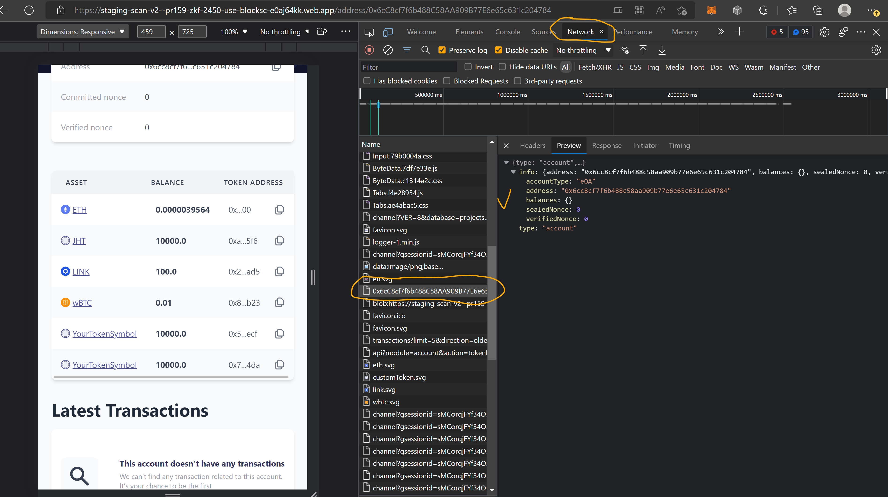
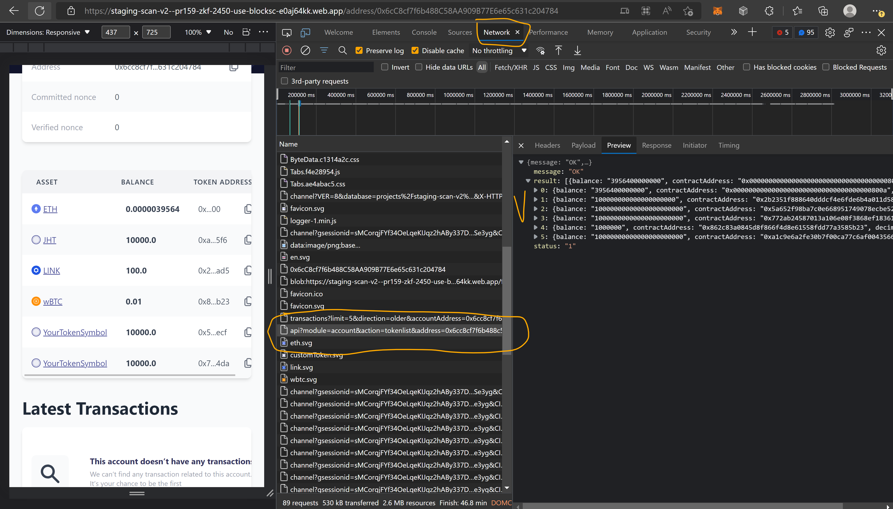

# id546 API - Common - Get balance

## Description
Create a Custom token

###### Step 1

Create your own ERC20 token on L1 on Goerli network:
- it should have the following name: 
  - 2 first letters of your First Name and 2 first letters of your Last Name.
For example for me it would be ANdrii DRebot, so ANDR.- 
  - it should have 18 decimals
  - total supply \> 1000

To create a token you can follow any guideline on the internet, for example this one: https://docs.alchemy.com/alchemy/tutorials/deploy-your-own-erc20-token
Once you've done, send 50 tokens to between your L1 to confirm using MetaMask.

###### Step 2
  - Deposit your token from L1 to L2. For that just follow our guideline here https://v2-docs.zksync.io/api/js/getting-started.html to make a deposit. This will automatically create your token on L2.
  - Make sure to use zksync-web3 v0.7.7 because the latest one does not work.
  - After that go to Portal (https://staging-portal.zksync.dev/) and add your custom token there. After that you should see your token balance on Balances and Transfer pages.
  - Please, be attentive and remember that token on L1 and L2 will have different addresses. Also, our block explorer will not show balances for custom tokens, but Blockscout will (https://zksync2-testnet.zkscan.io/). This is one of the ways you can get token address on L2 after a successful deposit.
  - Once you've done, Send 50 tokens between your L2 to confirm using Portal UI.

== = == = == Use API = == = == =
  - https://zksync2-testnet.zkscan.io/api-docs#account

Example: https://zksync2-testnet.zkscan.io/api?module=account&action=tokenlist&address=0x6cC8cf7f6b488C58AA909B77E6e65c631c204784

## Precondition

## Scenario
- Prepare a custom token on L2
- Make a request to show the balance
    - ?module=account&action=tokenlist&address=\{hash\}
- You can see the token with its balance
- ;
- Default balance is empty
    - Inspect -\> Network -\> Address -\> Empty balance list
;
- Blockscout API shows balance
    - Inspect -\> Network - \> api?module... -\> Balance
      ;